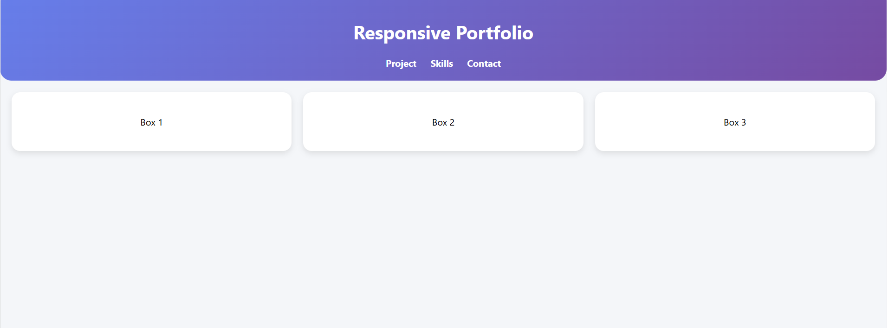
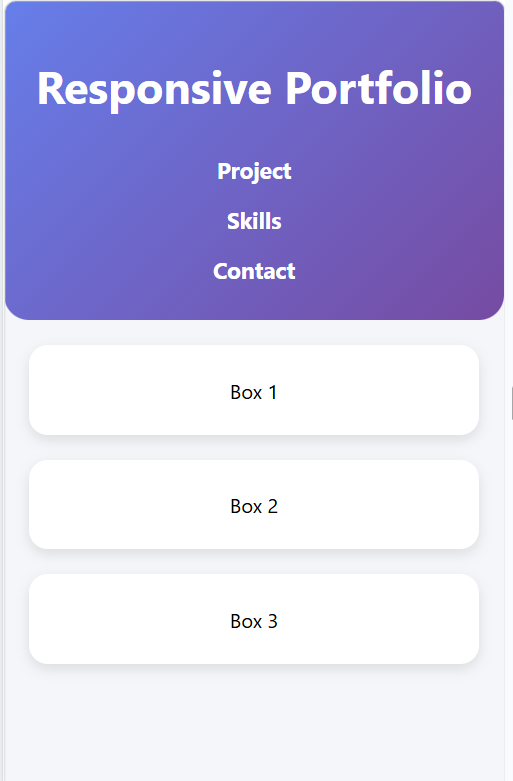

# 📱 Responsive Portfolio Website

## 📌 Project Overview

This project demonstrates how a desktop-only website can be converted into a **mobile-friendly responsive layout** using CSS media queries. The layout adapts smoothly across different screen sizes such as desktops, tablets, and mobile devices.

---

## 🎯 Objective

* Convert a fixed desktop layout into a responsive design
* Use **CSS media queries** to adjust layout for smaller screens
* Improve user experience on mobile devices

---

## 🛠️ Tools & Technologies Used

* HTML5
* CSS3
* VS Code
* Chrome DevTools

---

## ✨ Features

* 📱 Fully responsive design
* 🎨 Modern UI with gradient header and card layout
* 📐 Flexbox-based layout system
* 🔁 Smooth hover animations
* 📏 Adaptive spacing and font sizes
* 📊 Clean and structured layout

---

## 📱 Responsive Design Details

* Desktop View → Boxes displayed side-by-side
* Tablet/Mobile View → Boxes stacked vertically
* Navigation menu collapses into vertical layout
* Content adjusts based on screen width

---

## 📸 Preview

### 💻 Desktop View

### 📱 Mobile View

---

## 🧠 Key Concepts Learned

* CSS Media Queries
* Responsive Web Design
* Viewport Meta Tag
* Flexbox Layout
* Relative Units (% , rem, vw)

---

## 🚀 How to Run the Project

1. Download or clone the repository
2. Open the folder in VS Code
3. Open `index.html` in any browser
4. Use Chrome DevTools to test responsiveness

---

## 🎯 Outcome

Successfully implemented a **responsive web layout** that works across multiple screen sizes, improving accessibility and user experience.

---

## 🙌 Conclusion

This project helped in understanding how modern websites are built to be responsive and adaptive. Media queries and flexible layouts play a crucial role in real-world web development.

---

## 👩‍💻 Author

**Pradakshina S**
